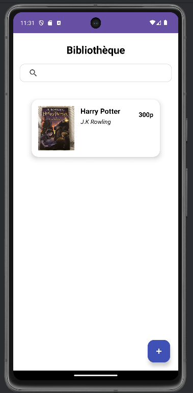
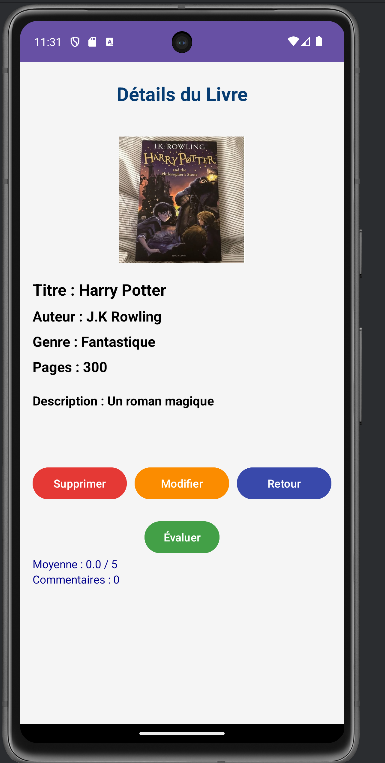
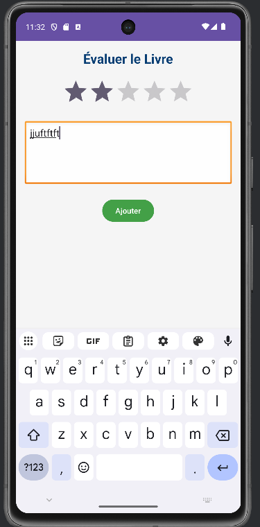

# 📚  Application Bibliothèque - Android

## 📖 Description
Une application Android de gestion de bibliothèque personnelle permettant d'organiser sa collection de livres, d'ajouter des évaluations et des commentaires.

## 🎯 Fonctionnalités

### 📋 Gestion des Livres
- **Ajouter** de nouveaux livres avec leurs informations complètes
- **Modifier** les détails des livres existants
- **Supprimer** des livres de la bibliothèque
- **Rechercher** des livres par titre

### ⭐ Système d'Évaluation
- **Noter** les livres sur 5 étoiles
- **Ajouter** des commentaires personnels
- **Visualiser** la moyenne des notes et le nombre de commentaires

### 📊 Affichage
- **Liste** des livres avec couvertures et informations essentielles
- **Détails** complets pour chaque livre
- **Interface** intuitive et responsive

## 🏗 Architecture de l'Application

### 🔧 Technologies Utilisées
- **Kotlin** - Langage de programmation
- **Android Jetpack** - Composants modernes Android
    - RecyclerView pour les listes
    - CardView pour les éléments UI
- **Material Design** - Design cohérent et moderne
- **Architecture MVC** - Pattern architectural

##  📱 Écrans de l'Application

### 🏠 Écran Principal (`MainActivity`)
- Liste de tous les livres
- Barre de recherche en temps réel
- Bouton flottant pour ajouter un livre
- Affichage carte avec image, titre, auteur et pages

### 🔍 Écran Détails (`ActivityDetails`)
- Informations complètes du livre
- Actions : Supprimer, Modifier, Évaluer
- Affichage de la moyenne des notes et nombre de commentaires
- Navigation retour à la liste

### ✏️ Formulaire Livre (`ActivityFormulaire`)
- Interface unique pour ajouter et modifier
- Validation des champs obligatoires
- Sélection d'image depuis la galerie
- Sélection du genre via Spinner

### ⭐ Évaluation (`ActivityEvaluation`)
- Notation par étoiles (1-5)
- Zone de texte pour commentaire
- Validation de la note obligatoire
#  Application Bibliothèque - Android

##  📚 Genres Supportés
- Science
- Roman
- Historique
- Policier
- Philosophie

##  ⚙️ Installation et Utilisation

### 🧰 Prérequis
- Android Studio Arctic Fox ou supérieur
- SDK Android API 21 ou supérieur
- Émulateur Android ou appareil physique

### 🚀 Démarrage
1. Cloner le projet
2. Ouvrir dans Android Studio
3. Synchroniser les dépendances Gradle
4. Exécuter sur émulateur ou appareil

## 📸 Captures d'écran

### 🏠 Acceuil

### 📖 Détails du Livre

### ➕ Ajouter un Livre

### ✏️ Modifier un Livre

### ⭐Évaluation

## 👥 Développement

### 🧑‍💻 Équipe de Développement
- **Sara Saadi**
- **Aziza Laafar**

### 📅 Date de Développement
25 Novembre 2025

